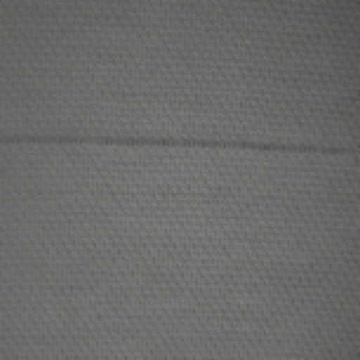
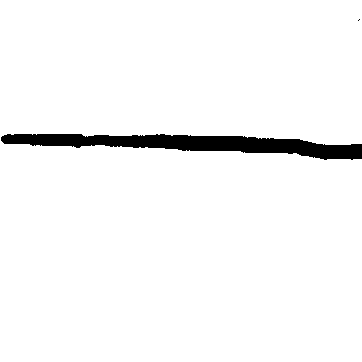

<div align="center">
    <span style="font-size:60px; font-weight:bold; color:black;">Texture</span>
</div>

---

**[DEMO影片](https://drive.google.com/file/d/1FIBpg0cUHm_EhO5W6WpPrasOudYZqgrj/view?usp=sharing)**


組員(依學號排列)
[資工3B 412411281 劉奕霈](https://github.com/rainyyy-yyy)
[資工3B 413417378 梁芷綾](https://github.com/ichbinjess-git)


# 環境配置
**1. 本程式使用Visual Studio Code編譯器**

**2. 執行以下指令，以配置所需環境**
```bash
cd texture/utils
pip install -r requirements.txt
```

# 輸入檔案規範
**1. 輸入之測試影像(input)與標準答案(target)應分為兩個資料夾**
資料夾結構應如下示意圖
```bash
dataset/
  input/
    input_1.png
    ...
  target/
    target_1.png
    ...
```

**2. 圖片檔名應為input_或target_開頭，且底線(_)後的代號須相同**
例如：測試影像名為input_abc123.png，則標準答案檔名應為target_abc123.png

**3. 輸入之測試影像應為512x512灰階圖片；標準答案應為512x512白底圖，破洞處用黑色標出**
例如：
<div style="display: flex; align-items: center; gap: 20px; justify-content: flex-start;">
  <div style="text-align: center;">
    
    <div>Input</div>
  </div>
  <div style="text-align: center;">
    
    <div>Target</div>
  </div>
</div>


# 修改路徑
本程式須確認幾個地方的檔案路徑是否正確：

**1. texture/conf/settings.py line32**
```bash
DATASET_ROOT = "D:/Change_To_Your_Root"
```
**2. texture/run.py line15**
```bash
parser.add_argument('--weights_dir', type=str, default='D:/Change_To_Your_pth_File',
                    help='pth 所在資料夾')
```
**3. texture/run.py line18**
```bash
parser.add_argument('--test_dirs', type=str, nargs='+',
                    default=['D:/Change_To_Your_Test_File'],
                    help='test 資料夾 (含 input/target 子資料夾)')
```
**4. texture/run.py line20**
```bash
parser.add_argument('--output_dir', type=str, default='D:/Change_To_Your_Output_File',
                    help='儲存生成圖片的資料夾')
```

# 執行程式
**1. 確認已修改run.py中的路徑**
```bash
# line15
parser.add_argument('--weights_dir', type=str, default='D:/Change_To_Your_pth_File',
                    help='pth 所在資料夾')

# line18 資料夾下須包含input與target兩個資料夾
parser.add_argument('--test_dirs', type=str, nargs='+',
                    default=['D:/Change_To_Your_Test_File'],
                    help='test 資料夾 (含 input/target 子資料夾)')

# line20
parser.add_argument('--output_dir', type=str, default='D:/Change_To_Your_Output_File',
                    help='儲存生成圖片的資料夾')
```

**2. 按下執行按鈕，或在git bash輸入指令：**
```bash
python run.py
```

**3. 執行結果**

首先，會看到每一張圖片的Accuracy、Precision、Recall
```bash
# 範例
[input_91_90_l_90.png]  Acc=0.9624  Prec=0.9633  Rec=0.9986
[input_92_s12_l_s12.png]  Acc=0.9559  Prec=0.9559  Rec=0.9994
[input_95_lr_l_lr.png]  Acc=0.9644  Prec=0.9640  Rec=0.9999
[input_97_90_l_90.png]  Acc=0.9551  Prec=0.9551  Rec=0.9996
[input_97_lr_l_lr.png]  Acc=0.9560  Prec=0.9559  Rec=0.9998
[input_98_180_l_180.png]  Acc=0.9504  Prec=0.9508  Rec=0.9994
```
最後會顯示從所有圖片計算的模型平均指標
```bash
# 範例
模型 checkpoint_epoch_70 平均指標：
SSIM=0.9653 | PSNR=19.90
Fake → Acc=0.9800, Prec=0.9805, Rec=0.9993
```
而圖片檔案會輸出至設定的路徑位置

# 各程式檔說明
**1. texture/conf/**
[settings.py](conf/settings.py)：train的訓練設定，需修裡面的改檔案路徑

**2. texture/models/**
[generator_3.py](models/generator_3.py)、[models_v3.py](models/models_v3.py)、[pytorch_msssim.py](models/pytorch_msssim.py)：模型，給部分程式呼叫

**3. texture/utils/**
[requirements.txt](utils/requirements.txt)：配置環境所需工具與其版本
[make_video.py](utils/make_video.py)：建立影片用，需修裡面的改檔案路徑
[rename.py](utils/rename.py)：重新命名圖片，需修裡面的改檔案路徑
[save_frame.py](utils/save_frame.py)：抓取影片每一幀，需修裡面的改檔案路徑
[spilt_dataset.py](utils/spilt_dataset.py)：分割資料集，需修裡面的改檔案路徑
[texture_dataloader.py](utils/texture_dataloader.py)：供部分程式讀取圖片用

**4. texture/**
[run.py](run.py)：生成判斷瑕疵位置圖片，並顯示Acc、Pre、Rec，需修裡面的改檔案路徑
[ssim_psnr.py](ssim_psnr.py)：判斷pth檔Acc、Pre、Rec，需修裡面的改檔案路徑
[train.py](train.py)：訓練Pix2Pix，需修裡面的改檔案路徑